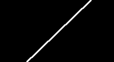
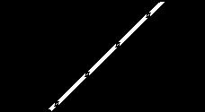

# Canny Edge Detector from Scratch
**Author:** Joseph Pokuta

**Course:** Intro to Robotics (EE2180) | Michigan Technological University

**Date:** 4/15/25 (Updated 3/22/26)

This project implements multi-stage Canny Edge Dection of an image in Python without relying on `cv2.Canny()`.

## Implementation
The pipeline processes raw images through five stages to extract edge structure while suppressing noise.

### Gaussian Blurring
To reduce image noise, I applied a Gaussian filter. The weight $G$ at any pixel $(x, y)$ is calculated using the 2D Gaussian distribution:

$$G(x, y) = \frac{1}{2\pi\sigma^2} e^{-\frac{x^2 + y^2}{2\sigma^2}}$$

In my implementation, I utilized `np.meshgrid` to generate the coordinate space and `np.exp` for the exponential decay, allowing for dynamic $\sigma$ tuning.
* **Standard Deviation ($\sigma$):** Controls the "spread." A higher $\sigma$ was used for the **Noisy Cameraman** sample to suppress high-frequency noise.
* **Kernel Size:** 3x3 kernels were used for fine detail, while 5x5 was used for the **High Shadow Lift Bridge** to smooth over shadow gradients.

### Sobel Gradient
Using Sobel-X and Sobel-Y kernels to find the intensity gradients.
* **Magnitude:** $\sqrt{G_x^2 + G_y^2}$
* **Direction:** $\arctan2(G_y, G_x)$

### Non-Maximum Suppression (NMS)
Edges are thinned by comparing a pixel's magnitude to its neighbors along the gradient direction. If the center pixel isn't the local maximum, it is suppressed to zero.

### Double Thresholding & Hysteresis
Pixels are classified into three categories based on `maxRatio` and `minRatio`:
1. **Strong (255):** Above `highThresh`.
2. **Weak (75):** Between `lowThresh` and `highThresh`.
3. **Suppressed (0):** Below `lowThresh`.

**Hysteresis:** Weak pixels are only promoted to Strong if they are connected to an existing Strong pixel within 8 adjacent tiles.

## How to Run

### Prerequisites
Ensure the necessary Python libraries: `numpy`, `opencv-python` (for image I/O), and `matplotlib`.
```bash
pip install opencv-python numpy matplotlib
```

### Running the Pipeline
1. Clone the repository.
2. Ensure your test images are in the `/images` folder.
3. Navigate to the source directory and run the script:
```bash
cd src
python canny_detector.py
```

## Results and Tuning
Different image characteristics require specific tuning. I found that the **High-Shadow Lift Bridge** required a larger 5x5 kernel and higher thresholds to avoid false edges caused by shadow boundaries.
| Image Case | Kernel | $\sigma$ | Low Ratio | High Ratio |
| :--- | :---: | :---: | :---: | :---: |
| Sanity Check | 3x3 | 0.5 | 0.05 | 0.15 |
| Noisy Cameraman | 3x3 | 1.5 | 0.05 | 0.50 |
| Lift Bridge | 5x5 | 1.5 | 0.25 | 0.50 |

### Pipeline Progression: Sanity Check
| Original | Gaussian Blur | Sobel Magnitude | Final Canny |
| :---: | :---: | :---: | :---: |
|  |  |  |  |
